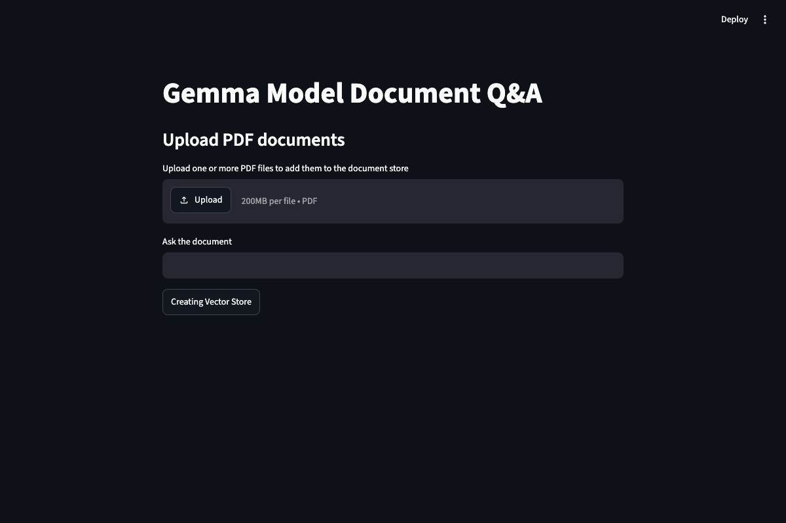
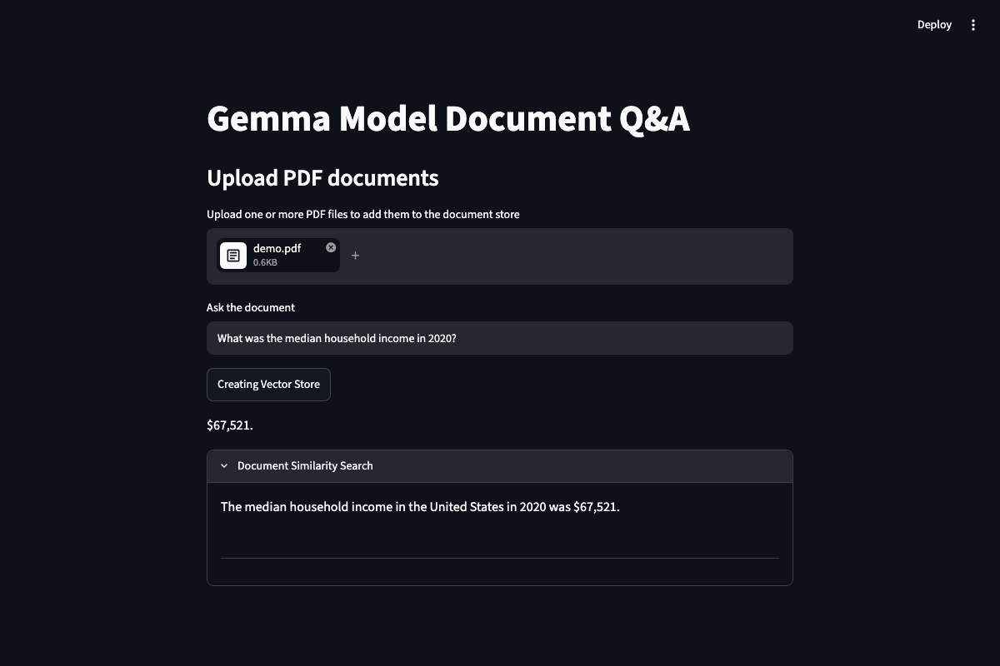

<div align="center">

# 📄 PDF Q&A App

**Ask questions about your own PDFs — answered using only their content.**


</div>

<p align="center">
  
  
</p>

A RAG (Retrieval-Augmented Generation) app: upload PDFs, they're chunked and
embedded with Google's `gemini-embedding-001`, indexed in a local FAISS
vector store, and retrieved on demand. Groq's `openai/gpt-oss-20b` answers
each question using only the retrieved chunks — with the source text shown
via **Document Similarity Search**.

## 🚀 Quick Start

```bash
python -m venv venv && source venv/bin/activate   # Windows: venv\Scripts\activate
pip install -r requirements.txt
```

```env
# .env
GROQ_API_KEY=your_groq_api_key
GOOGLE_API_KEY=your_google_api_key
```

```bash
streamlit run app.py
```

## 🛠 Stack

| Piece | Tool |
|---|---|
| UI | Streamlit |
| Orchestration | LangChain (`langchain-classic`) |
| Chat model | Groq — `openai/gpt-oss-20b` |
| Embeddings | Google Generative AI — `gemini-embedding-001` |
| Vector store | FAISS (in-memory) |
| PDF parsing | pypdf |
